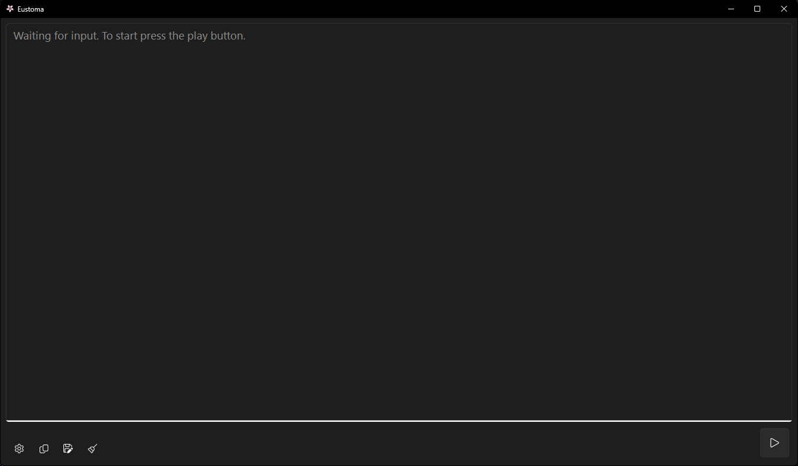
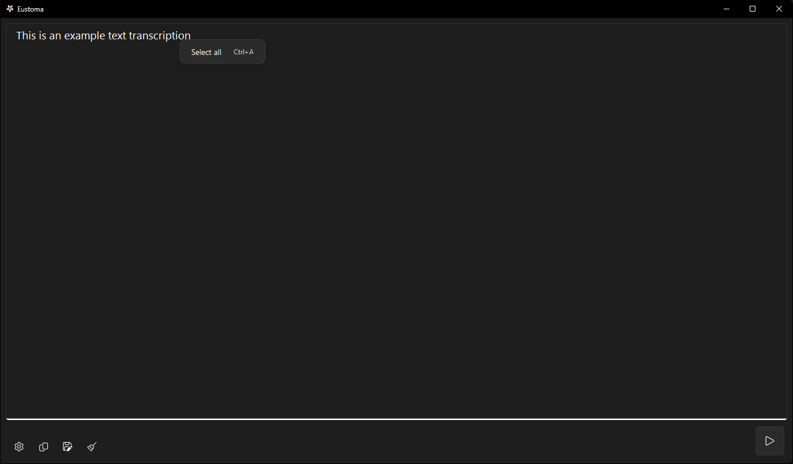

# About

Yet another speech-to-text app, powered by faster-whisper and QFluentWidgets. 

## Features

- **Choose your model**: Support for different speech recognition models via faster-whisper
- **Modern UI**: Built with PyQt and QFluentWidgets for a modern look and feel
- **GPU support**: Runs on NVIDIA GPU or any CPU (for smaller models)
- **Copy to clipboard**: Copy transcribed text to the clipboard with a single click
- **Save to file**: Save transcribed text as .txt
- **Fully Local**: The application runs completely offline after downloading whisper model.


## Getting Started

### Prerequisites

1) [Python 3.12](https://www.python.org/downloads/release/python-3129/)
2) [Git](https://git-scm.com/downloads)
3) Windows

### Installation

1. Clone the repository:
   ```bash
   git clone https://github.com/icosane/eustoma.git
   ```
   or download the latest release (the .zip file) and extract its contents to your computer.

2. Navigate to the folder and create a virtual environment:
    ```bash
    python -m venv .
    ```
3. Activate the virtual environment:
    ```
    .\\Scripts\\activate
    ```
4. Install the requirements from the file: 
    ```
    pip install -r requirements.txt
    ```

Or open the extracted folder in [Visual Studio Code](https://code.visualstudio.com/download) / [VSCodium](https://github.com/VSCodium/vscodium/releases), press ```Ctrl+Shift+P```, type ```Python: Create Environment```, select ```.venv```, use ```requirements.txt``` and wait for it to finish.

### Building .EXE
1. Install PyInstaller in your .venv:
```pip install pyinstaller```
2. Run ```pyinstaller build.spec```
3. Locate the ```./dist/main/``` folder. Copy the resources folder there so that the final tree looks like this:
```
main/
├── _internal/
├── resource/
├── Eustoma.exe
```

### Usage

1. When launching the app for the first time, go to Settings and download the model you want to use.
2. If you have an NVIDIA GPU (you can check at the top of the Settings), set Device to ```cuda```.
3. On the main screen, press the Play button to start recording, and press again to stop and transcribe.
4. You can copy the transcribed text to the clipboard or save it as a .txt file using the buttons next to the Settings button.


### Acknowledgments

- [faster-whisper](https://github.com/SYSTRAN/faster-whisper)
- [QFluentWidgets](https://github.com/zhiyiYo/PyQt-Fluent-Widgets)
- [PyQt6](https://pypi.org/project/PyQt6/)
- [pywinrt](https://github.com/pywinrt/pywinrt)
- [PyAudio](https://people.csail.mit.edu/hubert/pyaudio/)
- [numpy](https://numpy.org/)
- [psutil](https://github.com/giampaolo/psutil)
- [GPUtil](https://github.com/anderskm/gputil)
- [PyInstaller](https://pyinstaller.org/)
- [flower icons](https://www.flaticon.com/free-icons/flower) - Flower icons created by Triberion - Flaticon

### Screenshots
<div style="display: flex; flex-direction: column;">
    
    
    
</div>