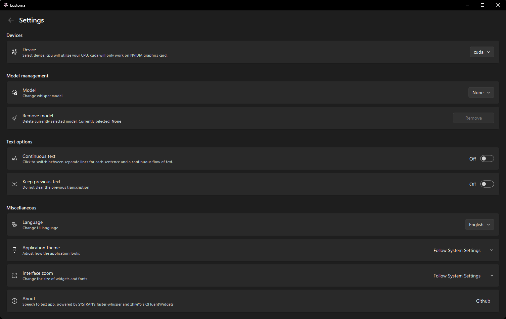

# About

Yet another speech-to-text app, powered by faster-whisper and QFluentWidgets. 

It was developed specifically for a family member, and as such, it is provided as-is. Please note that the project may not receive any new features or fixes in the future.

## Features

- **Model Selection**: Support for various speech recognition models via  faster-whisper
- **Modern UI**: Built with PyQt and QFluentWidgets for a modern look and feel
- **GPU support**: Compatible with NVIDIA GPUs and can also run on any CPU (for smaller models).
- **Copy to clipboard**: Easily copy transcribed text to the clipboard with a single click.
- **Save to file**: Save transcribed text as a .txt file.
- **Fully Local**: The application operates completely offline after downloading the whisper model.


## Getting Started

### Prerequisites

1) [Python 3.12](https://www.python.org/downloads/release/python-3129/)
2) [Git](https://git-scm.com/downloads)
3) Windows

### Installation

1. Clone the repository:
   ```bash
   git clone https://github.com/icosane/eustoma.git
   ```
   or download the latest release (the .zip file) and extract its contents to your computer.

2. Navigate to the folder and create a virtual environment:
    ```bash
    python -m venv .
    ```
3. Activate the virtual environment:
    ```
    .\\Scripts\\activate
    ```
4. Install the requirements from the file: 
    ```
    pip install -r requirements.txt
    ```

Or open the extracted folder in [Visual Studio Code](https://code.visualstudio.com/download) / [VSCodium](https://github.com/VSCodium/vscodium/releases), install Python extension, then press ```Ctrl+Shift+P```, type ```Python: Create Environment```, select ```.venv```, use ```requirements.txt``` and wait for it to finish.

### Building .EXE
1. Install PyInstaller in your .venv:
```pip install pyinstaller```
2. Run ```pyinstaller build.spec```


## Usage

1. **First Launch**: When you launch the app for the first time, navigate to the Settings and download the model you wish to use.
2. **Device Configuration**: If you have an NVIDIA GPU (you can verify this at the top of the **Settings**), set the Device option to ```cuda```.
3. **Recording**: On the main screen, press the **Play** button to start recording. Press it again to stop recording and transcribe the audio.
4. **Text Management**: You can copy the transcribed text to the clipboard or save it as a .txt file using the buttons located next to the **Settings** button.

### Keyboard Shortcuts
- ```Alt + C``` to copy to clipboard
- ```Ctrl + S``` to save to file
- ```Delete``` to clear text field
- ```Spacebar``` to start/stop recording


## Acknowledgments

- [faster-whisper](https://github.com/SYSTRAN/faster-whisper)
- [QFluentWidgets](https://github.com/zhiyiYo/PyQt-Fluent-Widgets)
- [PyQt6](https://pypi.org/project/PyQt6/)
- [nvidia-cublas](https://pypi.org/project/nvidia-cublas-cu12/)
- [nvidia-cuda-runtime](https://pypi.org/project/nvidia-cuda-runtime-cu12/)
- [nvidia-cudnn](https://pypi.org/project/nvidia-cudnn-cu12/)
- [pywinrt](https://github.com/pywinrt/pywinrt)
- [PyAudio](https://people.csail.mit.edu/hubert/pyaudio/)
- [numpy](https://numpy.org/)
- [psutil](https://github.com/giampaolo/psutil)
- [GPUtil](https://github.com/anderskm/gputil)
- [PyInstaller](https://pyinstaller.org/)
- [flower icons](https://www.flaticon.com/free-icon/jasmine_2926745) - Flower icons created by Triberion - Flaticon

## Screenshots
<div style="display: flex; flex-direction: column;">
    
    
    
</div>